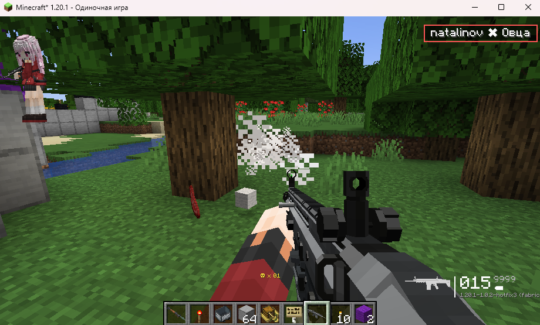

# 🎯 KillFeed Mod for Minecraft

[](https://minecraft.net)
[](https://fabricmc.net)
[](LICENSE)
[](https://adoptium.net)

**🌐 Language / Язык:** [English](#english) | [Русский](#русский)

---

<div align="center">
  
</div>

---

## English

> A Counter-Strike style killfeed mod for Minecraft! Track PvP activity on your server with a beautiful interface in the top-right corner of the screen.

## 📋 Description

**KillFeed** is a client-side Minecraft mod that displays real-time information about player kills. Inspired by the killfeed system from Counter-Strike, the mod shows PvP event notifications in the style of popular shooters.

### ✨ Key Features

- 🎮 **CS-style Killfeed** - notifications are displayed in the top-right corner of the screen
- 🔴 **Highlight Your Actions** - your kills and deaths are highlighted with a red frame
- ⏰ **Auto-disappearing** - messages fade away after 5 seconds
- 🌐 **Server Synchronization** - all players see the same information
- 💾 **Lightweight and Performance-friendly** - minimal FPS impact
- 🎨 **Customizable Design** - semi-transparent background and colored highlighting

## 🖼️ Screenshots

*Screenshots of the mod interface in-game will be here*

## 🚀 Installation

### Requirements
- Minecraft 1.20.1
- Fabric Loader 0.15.6+
- Fabric API 0.92.2+
- Java 17

### Installation Steps
1. Download and install [Fabric Loader](https://fabricmc.net/use/)
2. Download [Fabric API](https://modrinth.com/mod/fabric-api)
3. Download the mod file `KillFeed-1.0.jar`
4. Place both .jar files in your Minecraft `mods` folder
5. Launch the game with Fabric profile

## 🎯 How It Works

### Killfeed Display
- Messages appear in format: **`Player1 ✖ Player2`**
- Your actions (kills/deaths) are highlighted with a red frame
- Each message is displayed for 5 seconds
- Multiple messages can be visible simultaneously

### Technical Details
- The mod uses Fabric API to track combat events
- Network packets synchronize data between server and clients
- HUD is rendered using DrawContext API
- Supports both singleplayer and multiplayer

## 🛠️ For Developers

### Project Structure
```
src/main/java/nsevenart/killfeed/
├── KillFeed.java           # Main mod class
├── KillfeedManager.java    # Server-side kill tracking logic
├── client/
│   └── KillFeedClient.java # Client-side HUD rendering
└── mixin/
    └── ExampleMixin.java   # Mixins for integration
```

### Key Components

#### KillfeedManager
- Tracks `ServerEntityCombatEvents.AFTER_KILLED_OTHER_ENTITY` events
- Sends network packets to all players on the server
- Determines event relevance for each player

#### KillFeedClient
- Registers HUD rendering via `HudRenderCallback`
- Handles incoming network packets
- Manages the list of active messages and their display

#### Implementation Features
- Uses `PacketByteBuf` for data transmission
- Timer system for automatic message removal
- Dynamic text positioning on the right edge of the screen

### Building the Project
```bash
# Build the mod
./gradlew build

# Run in development environment
./gradlew runClient
```

## 📝 Version History

### v1.0 (Current)
- ✅ Basic killfeed functionality
- ✅ Highlighting of own actions
- ✅ Network synchronization
- ✅ Auto-disappearing messages

### Future Plans
- 🔄 Position and size settings
- 🎨 Color and style customization
- 📊 Kill statistics
- 🔊 Sound effects

## 🤝 Contributing

This mod was developed for portfolio purposes and demonstrates skills in working with:
- Fabric API and Minecraft modding
- Network programming (client-server)
- HUD interfaces and rendering
- Event systems and callbacks

## 📄 License

This project is distributed under the MIT License. See [LICENSE](LICENSE) file for details.

## 👤 Author

**nsevenart** - mod developer

- GitHub: [@nsevenart](https://github.com/nsevenart)
- Mod created as part of Java developer portfolio

---

## Русский

> Мод, добавляющий киллфид в стиле Counter-Strike в Minecraft! Отслеживайте PvP активность на сервере с красивым интерфейсом в правом верхнем углу экрана.

## 📋 Описание

**KillFeed** - это клиентский мод для Minecraft, который отображает информацию о убийствах игроков в реальном времени. Вдохновленный системой киллфида из Counter-Strike, мод показывает уведомления о PvP событиях в стиле популярных шутеров.

### ✨ Основные особенности

- 🎮 **Киллфид в стиле CS** - уведомления отображаются в правом верхнем углу экрана
- 🔴 **Подсветка собственных действий** - ваши убийства и смерти выделяются красной рамкой  
- ⏰ **Автоматическое исчезновение** - сообщения исчезают через 5 секунд
- 🌐 **Синхронизация с сервером** - все игроки видят одинаковую информацию
- 💾 **Легкий и производительный** - минимальное влияние на FPS
- 🎨 **Настраиваемый дизайн** - полупрозрачный фон и цветное выделение

## 🖼️ Скриншоты

*Здесь будут скриншоты интерфейса мода в игре*

## 🚀 Установка

### Требования
- Minecraft 1.20.1
- Fabric Loader 0.15.6+
- Fabric API 0.92.2+
- Java 17

### Шаги установки
1. Скачайте и установите [Fabric Loader](https://fabricmc.net/use/)
2. Скачайте [Fabric API](https://modrinth.com/mod/fabric-api)
3. Скачайте файл мода `KillFeed-1.0.jar`
4. Поместите оба файла (.jar) в папку `mods` вашего Minecraft
5. Запустите игру с профилем Fabric

## 🎯 Как это работает

### Отображение киллфида
- Сообщения появляются в формате: **`Игрок1 ✖ Игрок2`**
- Ваши действия (убийства/смерти) выделяются красной рамкой
- Каждое сообщение отображается 5 секунд
- Максимум видно несколько сообщений одновременно

### Технические детали
- Мод использует Fabric API для отслеживания событий боя
- Сетевые пакеты синхронизируют данные между сервером и клиентами
- HUD отрисовывается с помощью DrawContext API
- Поддерживается как одиночная игра, так и мультиплеер

## 🛠️ Для разработчиков

### Структура проекта
```
src/main/java/nsevenart/killfeed/
├── KillFeed.java           # Главный класс мода
├── KillfeedManager.java    # Логика отслеживания убийств на сервере
├── client/
│   └── KillFeedClient.java # Клиентская часть и отрисовка HUD
└── mixin/
    └── ExampleMixin.java   # Mixins для интеграции
```

### Ключевые компоненты

#### KillfeedManager
- Отслеживает события `ServerEntityCombatEvents.AFTER_KILLED_OTHER_ENTITY`
- Отправляет сетевые пакеты всем игрокам на сервере
- Определяет релевантность события для каждого игрока

#### KillFeedClient  
- Регистрирует HUD рендеринг через `HudRenderCallback`
- Обрабатывает входящие сетевые пакеты
- Управляет списком активных сообщений и их отображением

#### Особенности реализации
- Использование `PacketByteBuf` для передачи данных
- Система таймеров для автоматического удаления сообщений
- Динамическое позиционирование текста по правому краю экрана

### Сборка проекта
```bash
# Сборка мода
./gradlew build

# Запуск в среде разработки
./gradlew runClient
```

## 📝 История версий

### v1.0 (Текущая)
- ✅ Базовый функционал киллфида
- ✅ Подсветка собственных действий
- ✅ Сетевая синхронизация
- ✅ Автоматическое исчезновение сообщений

### Планы на будущее
- 🔄 Настройки позиции и размера
- 🎨 Кастомизация цветов и стилей  
- 📊 Статистика убийств
- 🔊 Звуковые эффекты

## 🤝 Участие в разработке

Мод разработан для портфолио и демонстрации навыков работы с:
- Fabric API и Minecraft modding
- Сетевым программированием (клиент-сервер)
- HUD интерфейсами и отрисовкой
- Системами событий и callback'ов

## 📄 Лицензия

Этот проект распространяется под лицензией MIT. Подробности в файле [LICENSE](LICENSE).

## 👤 Автор

**nsevenart** - разработчик мода

---

*Created with love for Minecraft and inspiration from classic shooters! 🎮*

---
